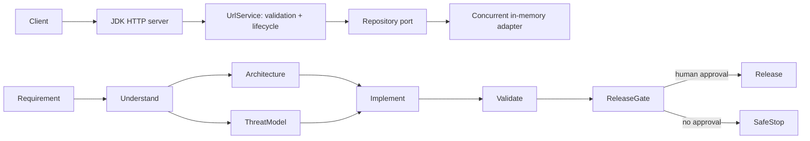

# Agentic URL Shortener — controlled-autonomy prototype

This is a runnable Java 17 URL-shortener service and an intentionally small, inspectable SDLC workflow engine. It demonstrates agents performing bounded engineering work while humans retain approval of release-impacting actions.

## Run

```bash
mvn -DskipTests package
java -jar target/agentic-url-shortener-1.0.0.jar
```

In another terminal:

```bash
curl -X POST http://localhost:8080/api/urls -H 'content-type: application/json' -d '{"url":"https://example.com/docs"}'
curl -i http://localhost:8080/<code>
curl http://localhost:8080/api/urls/<code>/analytics
./scripts/smoke-test.sh
```

Run validation without third-party test libraries:

```bash
mvn -DskipTests package
java -cp target/test-classes:target/classes demo.urlshortener.TestRunner
```

## Architecture and control flow



The product layer deliberately has a repository port. The default adapter is a local durable snapshot (`data/links.bin`) with atomic writes and synchronized read-modify-write visit increments; restart the server and links remain available. The current generator uses a process-local sequence: a multi-instance deployment should replace it with a collision-resistant, durable identifier service.

`WorkflowEngine` is the orchestration layer, not a linear task list. Its explicit directed graph controls dependencies; ready independent nodes run in parallel, then synchronise through their downstream dependencies. It carries outputs, timestamped decision/audit events, node state, latency, retry and rollback counts through the run. Each node has bounded attempts and an optional rollback. Failed or unapproved prerequisites prevent dependent work and result in a safe stop. Audit events are appended locally to `data/workflow-audit.log`. `GET /workflow/demo` deliberately stops at the release approval gate; a human must call `POST /workflow/release` with `X-Change-Approval: APPROVED` to release.

## Local reliability features

No infrastructure provisioning is required. The service implements a durable local store, atomic redirect counter updates, a per-client fixed-window creation limit (30/minute), URL policy enforcement (only credential-free absolute HTTP/S URLs, max 2048 characters), Prometheus-compatible `/metrics`, health reporting, workflow policy denial, durable audit journaling, and a one-command HTTP smoke test. Set `-Ddata.dir=/path/to/local-data` to choose the state directory. Delete that directory only when you explicitly want a clean local environment.

Additional controls now include a bounded five-minute LRU link cache, request correlation (`X-Request-Id`), durable idempotency keys, approval authentication (`X-Approver` plus `X-Approval-Token`; default local token is `local-demo-token`), and dependency-impact calculation at `/workflow/replan`. The latter returns the exact downstream nodes that must be invalidated/re-run after an upstream decision changes. The published API contract is [docs/openapi.yaml](docs/openapi.yaml).

## Local authentication and authorization

Every API mutation and analytics read now requires `X-Api-Key`. The dependency-free development identities are `local-user-key` (`USER`, owns links it creates), `local-reviewer-key` (`REVIEWER`, can inspect workflow evidence and any analytics), `local-release-key` (`RELEASE_MANAGER`, can approve release), and `local-admin-key` (`ADMIN`, bypasses role checks). Redirects remain intentionally public. A release additionally requires `X-Change-Approval: APPROVED` and `X-Approval-Token: local-demo-token`. Override any development key with the corresponding `-Dauth.*.key` system property; never use these defaults beyond local testing.

For optional local metrics UI, with Docker installed, run `docker compose -f docker-compose.observability.yml up`; Prometheus is available at port 9090 and Grafana at port 3000. This is deliberately optional: all service tests remain dependency-free.

## Requirement normalization and decisions

**Intent.** Provide creation, resolution and click analytics for short URLs with a trustworthy path to release. **Ambiguities resolved for this prototype:** links do not expire; aliases, accounts, deletion, custom domains, quotas and privacy retention are deferred; analytics is total redirect count; only absolute `http`/`https` URLs are accepted. These decisions are captured by the `understand` workflow output so later steps can reason from the same context.

Security policy currently blocks non-web schemes before persistence. A production policy should additionally use DNS/IP allow lists to mitigate SSRF, rate-limit creation and redirects, hash or minimise personal data, enforce tenant authorization, use an async analytics event stream, and scan dependencies. The redirect target is supplied by a user, so teams must decide and document open-redirect policy; this prototype allows web targets by design.

## Three execution scenarios

| Scenario | Decomposition and dependencies | Governance / validation |
| --- | --- | --- |
| Greenfield: base shortener | understand → parallel architecture + threat model → implement → validate → release | Release requires human approval. Unit harness verifies creation, redirect counting and scheme validation. |
| Brownfield: add durable analytics store | inspect repository contract and API read flow → schema/migration + adapter implementation in parallel → backfill → load/integration tests → release | Migration and data retention are high-impact gates; rollback is adapter switch/migration reversal. Existing `UrlRepository` isolates the impact. |
| Ambiguous: customer asks for “private links” | clarify whether private means unguessable, authenticated, expiring, or hidden analytics → record decision → model policy + API contract → implement/tests | The engine must pause at the approval/clarification gate; it must not choose an access-control model autonomously. Upstream decision changes invalidate dependent nodes and require re-planning. |

## Dynamic replanning, reliability and auditability

On a changed upstream output, mark its transitive dependents `PENDING`/invalidated, append an audit event containing the prior decision and reason, then execute only the affected subgraph after the appropriate approval. Never silently reuse an implementation built for an obsolete requirement. In a production deployment, persist graph definitions, node input/output hashes, actor/approval identity, correlation IDs and immutable audit events to an append-only store.

Metrics to expose per workflow and release train: `successful_runs / completed_runs`, retries per run, rollback frequency, mean time from failure to recovered/safe-stopped state (MTTR), and start-to-terminal-state latency. Alert on an elevated retry/rollback ratio, unapproved release attempts, policy denials, and nodes exceeding a time budget. The code exposes a run's latency/retry/rollback counters and audit events; a metrics adapter is the next integration point.

## Limitations and trade-offs

This is a prototype, not an internet-facing deployment: state disappears on restart; JSON parsing is purposely narrow; analytics are not atomic under multiple concurrent redirects; no authentication, rate limits, TLS, persistence, observability backend, authentication of approvals, or actual LLM calls are included. The compact JDK-only stack maximises reviewability and offline reproducibility. A production evolution should use a hardened framework, database migrations, durable job/event orchestration, OpenTelemetry, secrets management, CI security scans, contract tests, and a signed approval/change-control integration.
